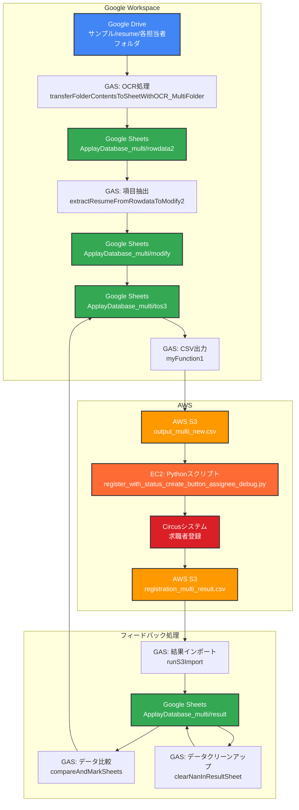

# Circus求職者登録システム - システム仕様書

## 1. 目的 (Purpose)

求職者管理システム（Circus）への登録自動化により、担当者の工数削減を実現し、業務効率化を図ることを目的としています。

## 2. システム概要 (System Overview)

### 2.1 システム全体の役割

本システムは、Google Driveに保存された履歴書ファイルから求職者情報を自動抽出し、Circus求職者管理システムへの登録を自動化する統合システムです。

### 2.2 主要構成要素

- **Google Drive**: 履歴書ファイルの保存場所
- **Google Apps Script (GAS)**: データ抽出・変換・転記処理
- **Google Sheets**: データの一時保存・加工・結果管理
- **AWS S3**: データファイルのクラウドストレージ
- **AWS EC2**: Pythonスクリプトの実行環境
- **Circus**: 求職者管理システム（登録先）

### 2.3 システム全体のデータフロー



## 3. 機能要件 (Functional Requirements)

### 3.1 Google Driveからの情報取得とスプレッドシートへの転記

**処理名**: 履歴書データ取得＆初期転記  
**GAS関数**: `transferFolderContentsToSheetWithOCR_MultiFolder()`  
**概要**: Google Drive内の各担当者フォルダーから履歴書ファイル（PDF、画像ファイル）を読み込み、OCR処理を通じてテキストデータを抽出します。抽出されたデータは、スプレッドシート `ApplayDatabase_multi` の `rowdata2` シートに転記されます。

**入力**: 
- Google Drive: `サンプル/resume/各担当者のフォルダー` 内の履歴書ファイル

**出力**: 
- Google Sheets: `ApplayDatabase_multi/rowdata2` シート

### 3.2 抽出データの項目別整形

**処理名**: 履歴書項目抽出＆整形  
**GAS関数**: `extractResumeFromRowdataToModify2()`  
**概要**: `rowdata2` シートに転記された生データから、必要な項目を抽出し、`ApplayDatabase_multi` スプレッドシートの `modify` シートに整形して転記します。

**抽出カラム**:
- `name`: 氏名
- `furigana`: フリガナ
- `birthYear`: 生年
- `birthMonth`: 生月
- `birthDay`: 生日
- `postal`: 郵便番号
- `address`: 住所
- `phone`: 電話番号
- `email`: メールアドレス
- `license`: 資格
- `education`: 学歴
- `person_in_charge`: 担当者

**入力**: `ApplayDatabase_multi/rowdata2` シート  
**出力**: `ApplayDatabase_multi/modify` シート

### 3.3 AWS S3へのデータ保存（中間データ）

**処理名**: Circus登録用データS3保存  
**GAS関数**: `myFunction1()`  
**概要**: `ApplayDatabase_multi` スプレッドシートの `tos3` シートのデータをCSV形式でエクスポートし、AWS S3バケットに保存します。

**出力先**: `s3://dev1-randd/register-circus/output_data/output_multi_new.csv`

### 3.4 Circusへの求職者登録

**処理名**: Circus求職者登録処理  
**実行環境**: AWS EC2インスタンス (`i-01d87e3dfdb8cfd1f`)  
**実行スクリプト**: `/home/ec2-user/register_with_status_create_button_assignee_debug.py`  
**概要**: EC2インスタンス上でPythonスクリプトが定期実行され、S3に保存されたCSVデータを読み込み、Circusシステムへ求職者情報を登録します。

**実行頻度**: 毎時0分 (`0 * * * *`) のCronジョブにより実行  
**ログイン情報**: 環境変数 `email`, `password` で管理  
**実行ログ**: `/home/ec2-user/logs/registration.log`

### 3.5 Circus登録結果のS3への保存

**処理名**: Circus登録結果S3保存  
**概要**: Circusへの登録処理が完了した後、その結果（成功/失敗など）がCSVファイルとしてAWS S3に保存されます。

**出力先**: `s3://dev1-randd/register-circus/result/registration_multi_result.csv`

### 3.6 Circus登録結果のスプレッドシートへの転記

**処理名**: Circus登録結果スプレッドシート転記  
**GAS関数**: `runS3Import()`  
**概要**: S3に保存された登録結果CSVファイルを読み込み、`ApplayDatabase_multi` スプレッドシートの `result` シートに転記します。

**入力**: `s3://dev1-randd/register-circus/result/registration_multi_result.csv`  
**出力**: `ApplayDatabase_multi/result` シート

### 3.7 登録済み求職者のマーク

**処理名**: 登録状況比較＆マーク  
**GAS関数**: `compareAndMarkSheets()`  
**概要**: `result` シートと `tos3` シートを比較し、すでにCircusへの登録が行われた求職者については、`tos3` シートの「比較結果」カラムに `1` を記載します。未登録の求職者については、このカラムを空白のままにします。

### 3.8 データのクリーンアップ

**処理名**: 結果シートのデータ整形  
**GAS関数**: `clearNanInResultSheet()`  
**概要**: `result` シートと `modify` シートを比較する際、AWS EC2からの出力に空欄が `nan` として返される場合があるため、`nan` を空白に置換し、データ形式を統一します。

## 4. 非機能要件 (Non-Functional Requirements)

### 4.1 可用性

- 各GASスクリプトおよびEC2インスタンスは定期的に動作し、システムの可用性を維持する
- エラー発生時の自動リトライ機能
- システム障害時の代替処理フロー

### 4.2 パフォーマンス

- OCR処理: 1ファイルあたり30秒以内
- データ転記処理: 100件あたり5分以内
- Circus登録処理: 1件あたり10秒以内
- 全体処理時間: 1時間以内で完了

### 4.3 セキュリティ

- **Google Drive**: アクセス権限管理による適切なフォルダーアクセス制御
- **GAS**: 実行権限管理によるスクリプト実行制御
- **AWS S3**: IAM設定によるバケットアクセス権限管理
- **EC2**: セキュリティグループ設定によるネットワークアクセス制御
- **Circus**: ログイン情報の環境変数による安全な管理

### 4.4 運用・保守

- **ログ管理**: 
  - 実行ログ: `/home/ec2-user/logs/registration.log`
  - エラーログ: `/home/ec2-user/logs/error.log`
  - 監視方法: ログファイルの定期チェック

- **エラー通知**: 
  - 登録失敗時のメール通知機能
  - システム障害時のアラート機能

- **データバックアップ**: 
  - Google Sheets: 日次自動バックアップ
  - AWS S3: 自動バックアップ設定
  - 復旧手順の整備

## 5. 技術仕様

### 5.1 使用技術

- **Google Apps Script**: データ処理・転記
- **Python 3.x**: Circus登録処理
- **AWS S3**: ファイルストレージ
- **AWS EC2**: 実行環境
- **Cron**: 定期実行スケジューリング

### 5.2 ファイル構成

```
circus/
├── register_with_status_create_button_assignee_debug.py  # メイン登録スクリプト
├── requirements.txt                                      # Python依存関係
├── run_registration.sh                                   # 実行スクリプト
├── setup_cron.sh                                         # Cron設定スクリプト
└── system_architecture.md                               # システム仕様書
```

### 5.3 環境変数

- `email`: Circusログイン用メールアドレス
- `password`: Circusログイン用パスワード
- `S3_BUCKET`: S3バケット名
- `LOG_LEVEL`: ログレベル設定
