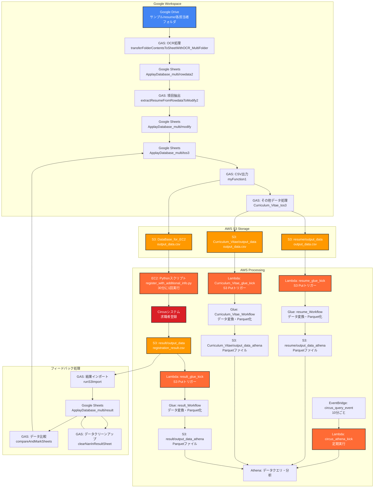

# Circus求職者登録システム - システム仕様書

## 目次

- [1. 目的 (Purpose)](#1-目的-purpose)
- [2. システム概要 (System Overview)](#2-システム概要-system-overview)
  - [2.1 システム全体の役割](#21-システム全体の役割)
  - [2.2 主要構成要素](#22-主要構成要素)
  - [2.3 システム全体のデータフロー](#23-システム全体のデータフロー)
- [3. AWS環境アーキテクチャ](#3-aws環境アーキテクチャ)
  - [3.1 AWS S3 ストレージ構造](#31-aws-s3-ストレージ構造)
  - [3.2 AWS Lambda 関数](#32-aws-lambda-関数)
  - [3.3 AWS Glue ワークフロー](#33-aws-glue-ワークフロー)
  - [3.4 IAMロールと権限](#34-iamロールと権限)
  - [3.5 Amazon EventBridge](#35-amazon-eventbridge)
- [4. 機能要件 (Functional Requirements)](#4-機能要件-functional-requirements)
  - [4.1 Google Apps Script によるデータ処理](#41-google-apps-script-によるデータ処理)
  - [4.2 EC2による求職者登録処理](#42-ec2による求職者登録処理)
  - [4.3 データ分析・処理パイプライン](#43-データ分析処理パイプライン)
- [5. エンドツーエンドデータフロー](#5-エンドツーエンドデータフロー)
- [6. 非機能要件 (Non-Functional Requirements)](#6-非機能要件-non-functional-requirements)
- [7. 技術仕様](#7-技術仕様)
- [8. 運用・監視](#8-運用監視)

---

## 1. 目的 (Purpose)

求職者管理システム（Circus）への登録自動化により、担当者の工数削減を実現し、業務効率化を図ることを目的としています。本システムは、Google WorkspaceとAWS環境を連携させた包括的なデータ処理・分析プラットフォームとして設計されています。

## 2. システム概要 (System Overview)

### 2.1 システム全体の役割

本システムは、Google Driveに保存された履歴書ファイルから求職者情報を自動抽出し、Circus求職者管理システムへの登録を自動化する統合システムです。さらに、登録されたデータの分析・集計処理をAWS環境で実行し、包括的なデータ管理を実現します。

### 2.2 主要構成要素

#### Google Workspace コンポーネント
- **Google Drive**: 履歴書ファイルの保存場所
- **Google Apps Script (GAS)**: データ抽出・変換・転記処理
- **Google Sheets**: データの一時保存・加工・結果管理

#### AWS コンポーネント
- **Amazon S3**: データファイルのクラウドストレージ
- **AWS EC2**: Pythonスクリプトの実行環境
- **AWS Lambda**: イベント駆動型データ処理関数
- **AWS Glue**: ETLワークフロー実行
- **Amazon Athena**: データクエリ・分析
- **Amazon EventBridge**: スケジュール実行管理

#### 外部システム
- **Circus**: 求職者管理システム（登録先）

### 2.3 システム全体のデータフロー



## 3. AWS環境アーキテクチャ

### 3.1 AWS S3 ストレージ構造

**バケット名**: `dev1-randd`  
**プライマリプレフィックス**: `register-circus/`

#### ディレクトリ構造
```
s3://dev1-randd/register-circus/
├── output_data/
│   ├── DataBase_for_EC2/
│   │   └── output_data.csv          # EC2スクリプト用入力データ
│   ├── resume/
│   │   └── output_data/
│   │       └── output_data.csv      # 履歴書データ（CSV）
│   └── Curriculum_Vitae/
│       └── output_data/
│           └── output_data.csv      # 職務経歴書データ（CSV）
└── result/
    ├── output_data/
    │   └── output_data.csv          # 登録結果データ（CSV）
    ├── resume/
    │   └── output_data_athena/
    │       └── *.parquet            # 履歴書データ（Parquet）
    ├── Curriculum_Vitae/
    │   └── output_data_athena/
    │       └── *.parquet            # 職務経歴書データ（Parquet）
    └── result/
        └── output_data_athena/
            └── *.parquet            # 登録結果データ（Parquet）
```

#### データフロー詳細

1. **入力データ**: Google Apps Scriptから各種CSVファイルがアップロード
2. **処理データ**: EC2スクリプトが `DataBase_for_EC2/output_data.csv` を処理
3. **結果データ**: 登録結果が `result/output_data/output_data.csv` に保存
4. **分析データ**: GlueワークフローによりParquet形式に変換され、Athenaで分析可能

### 3.2 AWS Lambda 関数

すべてのLambda関数は `circus_lambda_role` を実行ロールとして使用します。

#### 1. `resume_glue_kick`
- **目的**: 履歴書データ用のGlueワークフローをトリガー
- **トリガー**: S3オブジェクト作成 (Put) イベント
- **監視パス**: `s3://dev1-randd/register-circus/output_data/resume/output_data/output_data.csv`
- **実行アクション**: `glue:StartWorkflowRun` で `resume_Workflow` を開始

#### 2. `circus_athena_kick`
- **目的**: 求職者登録データの定期分析実行
- **トリガー**: Amazon EventBridge スケジュールイベント `circus_query_event`
- **実行頻度**: 10分ごと
- **実行アクション**: Athenaクエリの実行とデータ分析

#### 3. `result_glue_kick`
- **目的**: circus登録結果データ用のGlueワークフローをトリガー
- **トリガー**: S3オブジェクト作成 (Put) イベント
- **監視パス**: `s3://dev1-randd/register-circus/result/output_data/output_data.csv`
- **実行アクション**: `glue:StartWorkflowRun` で `result_Workflow` を開始

#### 4. `Curriculum_Vitae_glue_kick`
- **目的**: 職務経歴書データ用のGlueワークフローをトリガー
- **トリガー**: S3オブジェクト作成 (Put) イベント
- **監視パス**: `s3://dev1-randd/register-circus/output_data/Curriculum_Vitae/output_data/output_data.csv`
- **実行アクション**: `glue:StartWorkflowRun` で `Curriculum_Vitae_Workflow` を開始

### 3.3 AWS Glue ワークフロー

#### 1. `resume_Workflow`
- **入力**: `s3://dev1-randd/register-circus/output_data/resume/output_data/output_data.csv`
- **出力**: `s3://dev1-randd/register-circus/resume/output_data_athena/*.parquet`
- **処理内容**: CSVからParquet形式への変換、データクレンジング、スキーマ最適化

#### 2. `Curriculum_Vitae_Workflow`
- **入力**: `s3://dev1-randd/register-circus/output_data/Curriculum_Vitae/output_data/output_data.csv`
- **出力**: `s3://dev1-randd/register-circus/Curriculum_Vitae/output_data_athena/*.parquet`
- **処理内容**: CSVからParquet形式への変換、データクレンジング、スキーマ最適化

#### 3. `result_Workflow`
- **入力**: `s3://dev1-randd/register-circus/result/output_data/output_data.csv`
- **出力**: `s3://dev1-randd/register-circus/result/output_data_athena/*.parquet`
- **処理内容**: CSVからParquet形式への変換、登録結果の集計・統計処理

### 3.4 IAMロールと権限

#### `circus_lambda_role`
このロールはすべてのLambda関数によって引き受けられます。

**アタッチされているマネージドポリシー**:
- `AmazonAthenaFullAccess`: Athenaクエリの実行権限
- `AmazonS3FullAccess`: S3バケットへの読み書き権限
- `CloudWatchNetworkFlowMonitorAgentPublishPolicy`: CloudWatchログ出力権限
- `SimpleWorkflowFullAccess`: ワークフロー管理権限

**インラインポリシー (`workflow`)**:
```json
{
    "Version": "2012-10-17",
    "Statement": [
        {
            "Effect": "Allow",
            "Action": "glue:StartWorkflowRun",
            "Resource": [
                "arn:aws:glue:ap-northeast-1:744139898077:workflow/resume_Workflow",
                "arn:aws:glue:ap-northeast-1:744139898077:workflow/Curriculum_Vitae_Workflow",
                "arn:aws:glue:ap-northeast-1:744139898077:workflow/result_Workflow"
            ]
        }
    ]
}
```

**権限の範囲**:
- **リージョン**: `ap-northeast-1`
- **AWSアカウント**: `744139898077`
- **対象ワークフロー**: 特定の3つのGlueワークフローに限定

### 3.5 Amazon EventBridge

#### `circus_query_event`
- **目的**: データ分析の定期実行
- **スケジュール**: 10分ごと実行
- **ターゲット**: `circus_athena_kick` Lambda関数
- **実行内容**: Athenaクエリによるデータ分析・レポート生成

## 6. AWS環境アーキテクチャ

### 6.1 EC2インスタンス
- **インスタンス ID**: `i-01d87e3dfdb8cfd1f`
- **IP アドレス**: `35.76.121.86`
- **OS**: Amazon Linux 2023
- **Python**: 3.11系
- **タイムゾーン**: JST (Asia/Tokyo)
- **主要用途**: Circus求職者登録の自動化処理

**インストールパッケージ**:
```
selenium==4.26.0
boto3==1.35.59
pandas==2.2.3
beautifulsoup4==4.12.3
```

**実行スケジュール**:
```bash
# 30分間隔での自動実行
0,30 * * * * cd /home/ec2-user && python3 register_with_additional_info.py >> logs/registration.log 2>&1
```

### 6.2 AWS S3バケット構成

**バケット名**: `dev1-randd`

**ディレクトリ構造**:
```
s3://dev1-randd/
└── register-circus/
    ├── output_data/
    │   ├── DataBase_for_EC2/
    │   │   └── output_data.csv         # EC2処理用データ
    │   └── Curriculum_Vitae/
    │       └── output_data/
    │           └── output_data.csv     # 職務経歴書データ
    ├── result/
    │   ├── processed/                  # 処理済みファイル保存
    │   └── registration_result.csv     # 登録結果データ
    ├── glue-jobs/
    │   ├── resume_job_outputs/         # 履歴書処理結果
    │   ├── result_job_outputs/         # 登録結果処理結果
    │   └── curriculum_vitae_outputs/   # 職務経歴書処理結果
    └── error-logs/                     # エラーログ保存
```

### 6.3 Lambda関数

#### 6.3.1 resume_glue_kick
- **トリガー**: `s3://dev1-randd/register-circus/output_data/DataBase_for_EC2/` へのファイルアップロード
- **処理**: resume_Workflowの開始
- **IAMロール**: `circus_lambda_role`

#### 6.3.2 result_glue_kick
- **トリガー**: `s3://dev1-randd/register-circus/result/` へのファイルアップロード
- **処理**: result_Workflowの開始
- **IAMロール**: `circus_lambda_role`

#### 6.3.3 Curriculum_Vitae_glue_kick
- **トリガー**: `s3://dev1-randd/register-circus/output_data/Curriculum_Vitae/` へのファイルアップロード
- **処理**: Curriculum_Vitae_Workflowの開始
- **IAMロール**: `circus_lambda_role`

#### 6.3.4 circus_trigger_athena_query
- **トリガー**: EventBridge (10分間隔)
- **処理**: Athenaクエリの実行とデータ分析
- **IAMロール**: `circus_lambda_role`

### 6.4 Glueワークフロー

#### 6.4.1 resume_Workflow
- **入力**: `s3://dev1-randd/register-circus/output_data/DataBase_for_EC2/output_data.csv`
- **出力**: `s3://dev1-randd/register-circus/glue-jobs/resume_job_outputs/` (Parquet形式)
- **処理内容**: CSVからParquetへの変換、データクレンジング、スキーマ最適化

#### 6.4.2 result_Workflow
- **入力**: `s3://dev1-randd/register-circus/result/registration_result.csv`
- **出力**: `s3://dev1-randd/register-circus/glue-jobs/result_job_outputs/` (Parquet形式)
- **処理内容**: 登録結果データの変換と集計処理

#### 6.4.3 Curriculum_Vitae_Workflow
- **入力**: `s3://dev1-randd/register-circus/output_data/Curriculum_Vitae/output_data/output_data.csv`
- **出力**: `s3://dev1-randd/register-circus/glue-jobs/curriculum_vitae_outputs/` (Parquet形式)
- **処理内容**: 職務経歴書データの変換と分析用データ生成

### 6.5 IAMロール：circus_lambda_role

**アタッチされたポリシー**:
- `AWSLambdaBasicExecutionRole`
- `AWSGlueServiceRole`
- `AmazonS3FullAccess`
- `AmazonAthenaFullAccess`

**主要権限**:
- S3バケット `dev1-randd` への読み書き権限
- Glueワークフローの実行権限
- CloudWatch Logsへの書き込み権限
- Athenaクエリの実行権限

### 6.6 EventBridge設定
- **ルール名**: `circus-athena-trigger`
- **実行間隔**: 10分ごと (`rate(10 minutes)`)
- **ターゲット**: `circus_trigger_athena_query` Lambda関数
- **用途**: 定期的なデータ分析とレポート生成

### 6.7 Athena設定
- **データベース**: `circus_database`
- **テーブル**: 
  - `resume_data`: 履歴書データ
  - `registration_results`: 登録結果データ
  - `curriculum_vitae_data`: 職務経歴書データ
- **クエリ結果保存先**: `s3://dev1-randd/athena-query-results/`

## 7. セキュリティ・認証

### 7.1 アクセス管理
- **EC2ログイン情報**: 環境変数による管理
- **AWS認証**: IAMロールベースのアクセス制御
- **S3バケットアクセス**: 最小権限の原則に基づく設定

### 7.2 データ暗号化
- **S3**: サーバーサイド暗号化 (SSE-S3)
- **転送中**: HTTPS/TLS暗号化
- **認証情報**: 環境変数での機密情報管理

### 7.3 監査・ログ
- **CloudWatch Logs**: Lambda、Glue、EC2の実行ログ
- **S3アクセスログ**: データアクセスの追跡
- **登録処理ログ**: `/home/ec2-user/logs/registration.log`

## 8. 運用・監視

### 8.1 定期メンテナンス
- **EC2インスタンス**: 月次セキュリティパッチ適用
- **Python依存関係**: 四半期ごとの更新確認
- **ログローテーション**: 週次実行

### 8.2 エラー監視
- **CloudWatch アラーム**: Lambda関数実行エラー
- **S3イベント通知**: 処理失敗時のアラート
- **EC2ヘルスチェック**: インスタンス状態監視

### 8.3 バックアップ・復旧
- **S3データ**: バージョニング有効化
- **設定ファイル**: GitHubリポジトリでのバージョン管理
- **復旧手順**: EC2インスタンス再構築手順書

## 9. パフォーマンス最適化

### 9.1 処理速度向上
- **Parquet形式**: 分析クエリの高速化
- **データパーティショニング**: 日付ベースの分割
- **インデックス最適化**: Athenaクエリ性能向上

### 9.2 コスト最適化
- **S3ライフサイクル**: 古いデータの自動アーカイブ
- **Lambda関数**: メモリとタイムアウトの最適化
- **Glueジョブ**: DPU設定の調整

### 9.3 スケーラビリティ
- **Auto Scaling**: 処理量に応じたリソース拡張
- **Lambda同時実行数**: 適切な制限設定
- **データ量増加**: パーティション戦略の見直し

### 4.2 EC2による求職者登録処理

#### 4.2.1 システム構成
**実行環境**: AWS EC2インスタンス  
**実行スクリプト**: `/home/ec2-user/register_with_additional_info.py`  
**実行頻度**: 30分に1回 (`0,30 * * * *`) のCronジョブ

#### 4.2.2 処理フロー
1. **データ取得**: S3から登録対象のCSVファイルを取得
2. **ログイン**: Circusシステムにログイン
3. **求職者登録**: 基本情報の登録
4. **追加情報編集**: 最終学歴、卒業学校名、経験社数等の詳細情報を入力
5. **結果保存**: 登録結果をS3に保存

#### 4.2.3 主要機能
- **自動ログイン**: 環境変数で管理されたログイン情報を使用
- **担当者マッピング**: CSVの担当者情報をCircusの担当者IDに変換
- **エラーハンドリング**: 登録失敗時の詳細ログ出力
- **進捗管理**: 処理状況の記録と追跡

### 4.3 データ分析・処理パイプライン

#### 4.3.1 リアルタイム処理
S3へのファイルアップロードを契機として、Lambda関数が自動実行され、Glueワークフローが開始されます。

#### 4.3.2 バッチ処理
EventBridgeによる定期実行により、Athenaでのデータ分析が10分ごとに実行されます。

#### 4.3.3 データ変換
- **入力**: CSV形式の生データ
- **出力**: Parquet形式の分析最適化データ
- **処理**: データクレンジング、スキーマ最適化、集計処理

## 5. エンドツーエンドデータフロー

### 5.1 履歴書処理フロー
1. Google Drive → GAS (OCR) → Google Sheets → GAS (整形) → S3 (CSV)
2. S3 (CSV) → Lambda (resume_glue_kick) → Glue (resume_Workflow) → S3 (Parquet)
3. S3 (Parquet) → Athena (分析) → レポート生成

### 5.2 求職者登録フロー
1. Google Sheets → GAS (CSV出力) → S3 (DataBase_for_EC2)
2. EC2 (Pythonスクリプト) → S3 (CSV) → Circus (登録) → S3 (結果CSV)
3. S3 (結果CSV) → Lambda (result_glue_kick) → Glue (result_Workflow) → S3 (Parquet)
4. S3 (結果CSV) → GAS (結果インポート) → Google Sheets (フィードバック)

### 5.3 職務経歴書処理フロー
1. Google Sheets → GAS → S3 (Curriculum_Vitae CSV)
2. S3 (CSV) → Lambda (Curriculum_Vitae_glue_kick) → Glue (Curriculum_Vitae_Workflow) → S3 (Parquet)
3. S3 (Parquet) → Athena (分析) → レポート生成

## 4. 非機能要件 (Non-Functional Requirements)

### 4.1 可用性

- 各GASスクリプトおよびEC2インスタンスは定期的に動作し、システムの可用性を維持する
- エラー発生時の自動リトライ機能
- システム障害時の代替処理フロー

### 4.2 パフォーマンス

- OCR処理: 1ファイルあたり30秒以内
- データ転記処理: 100件あたり5分以内
- Circus登録処理: 1件あたり10秒以内
- 全体処理時間: 1時間以内で完了

### 4.3 セキュリティ

- **Google Drive**: アクセス権限管理による適切なフォルダーアクセス制御
- **GAS**: 実行権限管理によるスクリプト実行制御
- **AWS S3**: IAM設定によるバケットアクセス権限管理
- **EC2**: セキュリティグループ設定によるネットワークアクセス制御
- **Circus**: ログイン情報の環境変数による安全な管理

### 4.4 運用・保守

- **ログ管理**: 
  - 実行ログ: `/home/ec2-user/logs/registration.log`
  - エラーログ: `/home/ec2-user/logs/error.log`
  - 監視方法: ログファイルの定期チェック

- **エラー通知**: 
  - 登録失敗時のメール通知機能
  - システム障害時のアラート機能

- **データバックアップ**: 
  - Google Sheets: 日次自動バックアップ
  - AWS S3: 自動バックアップ設定
  - 復旧手順の整備

## 5. 技術仕様

### 5.1 使用技術

- **Google Apps Script**: データ処理・転記
- **Python 3.x**: Circus登録処理
- **AWS S3**: ファイルストレージ
- **AWS EC2**: 実行環境
- **Cron**: 定期実行スケジューリング

### 5.2 ファイル構成

```
circus/
├── register_with_status_create_button_assignee_debug.py  # メイン登録スクリプト
├── requirements.txt                                      # Python依存関係
├── run_registration.sh                                   # 実行スクリプト
├── setup_cron.sh                                         # Cron設定スクリプト
└── system_architecture.md                               # システム仕様書
```

### 5.3 環境変数

- `email`: Circusログイン用メールアドレス
- `password`: Circusログイン用パスワード
- `S3_BUCKET`: S3バケット名
- `LOG_LEVEL`: ログレベル設定
